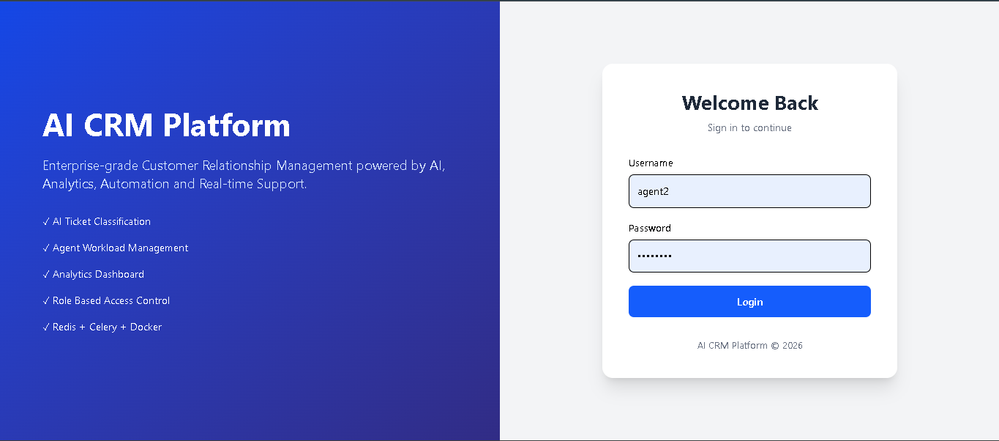
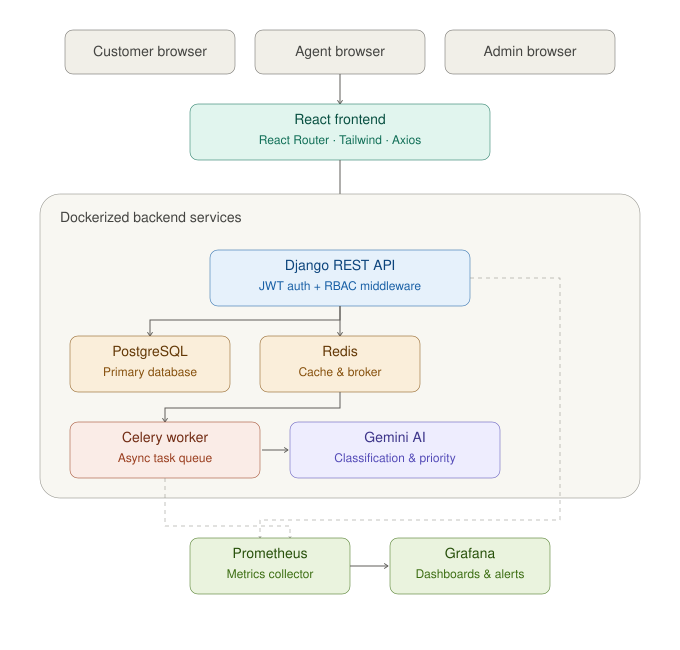
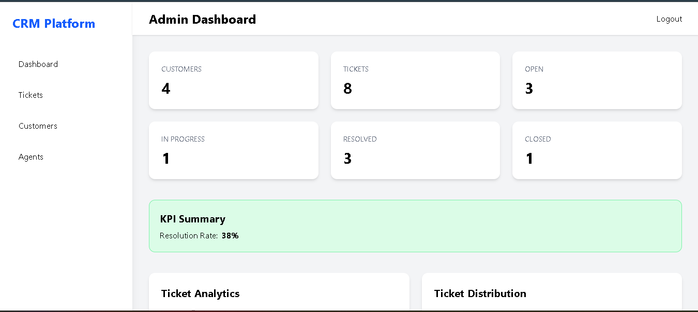
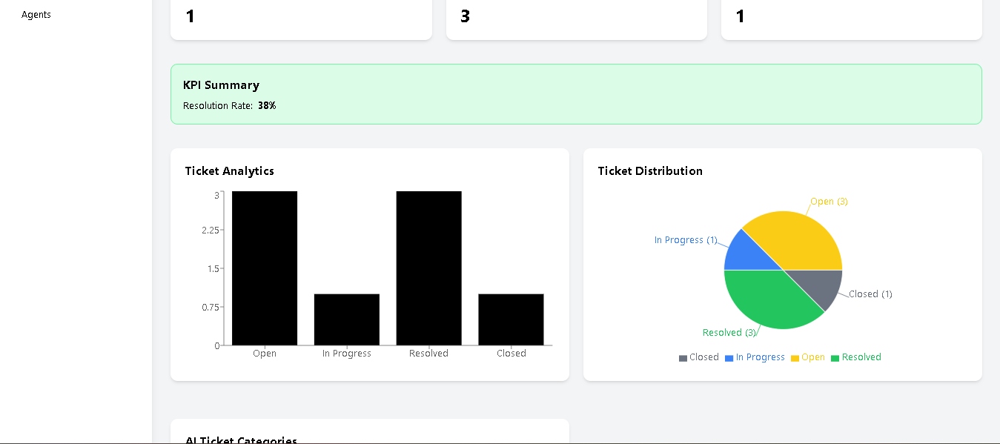
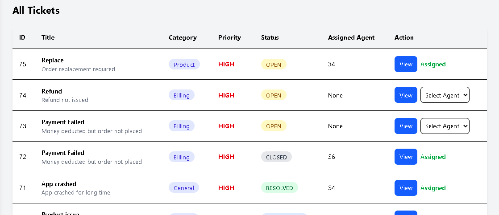
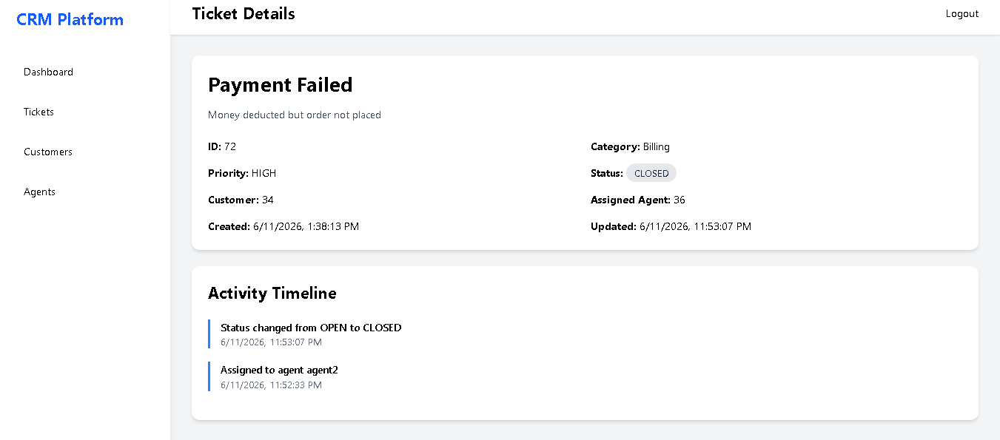

# 🚀 AI CRM Platform

<p align="center">
  
</p>

<h3 align="center">
Enterprise AI-Powered CRM Platform with Ticket Management, AI Classification, Monitoring & Observability
</h3>

<p align="center">


</p>

---

# 📌 Overview

AI CRM Platform is an enterprise-grade customer relationship management system built using React, Django REST Framework, PostgreSQL, Redis, Celery, Docker, Prometheus, Grafana, and Google Gemini AI.

The platform enables organizations to streamline customer support operations through AI-powered ticket classification, automated priority prediction, role-based access control, distributed task processing, monitoring, and observability.

---

# ✨ Features

## 🔐 Authentication & Authorization

* JWT Authentication
* Role-Based Access Control (RBAC)
* Admin Role
* Agent Role
* Customer Role
* Protected Routes

## 🤖 AI Ticket Classification

Google Gemini automatically analyzes:

* Ticket Title
* Ticket Description

and predicts:

### Categories

* Billing
* Technical
* Product
* Delivery
* Account
* General

### Priorities

* Low
* Medium
* High
* Critical

## 👨‍💼 Admin Dashboard

* Customer Analytics
* Ticket Analytics
* AI Category Analytics
* KPI Monitoring
* Agent Assignment
* Ticket Detail View
* Activity Timeline

## 👨‍💻 Agent Dashboard

* Assigned Tickets
* Ticket Status Updates
* Ticket Lifecycle Management
* Resolution Workflow

## 👤 Customer Dashboard

* Create Tickets
* Track Ticket Status
* View Assigned Agent
* Monitor Resolution Progress

## 📊 Monitoring & Observability

* Prometheus Metrics Collection
* Grafana Dashboards
* API Request Monitoring
* CPU Monitoring
* Memory Monitoring
* Service Health Tracking

---

# 🏗️ System Architecture

<p align="center">

</p>

---

# 🤖 AI Ticket Processing Flow

<p align="center">

</p>

### Flow

1. Customer creates ticket
2. Django stores ticket
3. Gemini AI classifies category
4. Gemini AI predicts priority
5. Ticket updated in PostgreSQL
6. Activity recorded
7. Redis cache invalidated
8. Celery notification task triggered
9. Ticket visible across dashboards

---

# 📈 Monitoring & Observability Architecture

<p align="center">

</p>

Supported Metrics:

* Request Count
* Request Rate
* API Latency
* CPU Usage
* Memory Usage
* Virtual Memory Usage
* Service Availability

---

# 🖥️ Application Screenshots

## Login Page

<p align="center">

</p>

---

## Admin Dashboard

<p align="center">

</p>

---

## Analytics Dashboard

<p align="center">

</p>

---

## Ticket Management

<p align="center">

</p>

---

## Agent Dashboard

<p align="center">

</p>

---

## Customer Dashboard

<p align="center">

</p>

---

## Customer Ticket View

<p align="center">

</p>

---

## Ticket Details & Activity Timeline

<p align="center">

</p>

---

# 📊 Grafana Dashboards

## System Health

<p align="center">

</p>

---

## API Request Monitoring

<p align="center">

</p>

---

## CPU Monitoring

<p align="center">

</p>

---

## Memory Monitoring

<p align="center">

</p>

---

## Virtual Memory Monitoring

<p align="center">

</p>

---

# 🛠️ Tech Stack

| Layer            | Technology            |
| ---------------- | --------------------- |
| Frontend         | React.js              |
| Styling          | Tailwind CSS          |
| Routing          | React Router          |
| Charts           | Recharts              |
| Backend          | Django                |
| API              | Django REST Framework |
| Authentication   | JWT                   |
| Database         | PostgreSQL            |
| Cache            | Redis                 |
| Background Jobs  | Celery                |
| AI Engine        | Google Gemini         |
| Monitoring       | Prometheus            |
| Visualization    | Grafana               |
| Containerization | Docker                |

---

# 🚀 Local Setup

## Clone Repository

```bash
git clone https://github.com/Avinash-2803/ai-crm-platform.git
```

## Backend

```bash
cd crm-backend
python -m venv venv
venv\Scripts\activate
pip install -r requirements.txt
```

## Frontend

```bash
cd crm-frontend
npm install
npm run dev
```

## Docker Deployment

```bash
docker compose up --build
```

---

# 📚 API Documentation

Swagger UI:

http://localhost:8000/api/docs/

---

# 📊 Monitoring

Prometheus:

http://localhost:9090

Grafana:

http://localhost:3000

---

# 🎯 Engineering Concepts Demonstrated

* AI Integration
* REST APIs
* RBAC
* JWT Security
* Database Design
* Redis Caching
* Background Processing
* Observability
* Monitoring
* Dockerized Deployment
* Distributed Systems Fundamentals

---

# 👨‍💻 Author

**Avinash Joshi**

GitHub:
https://github.com/Avinash-2803

---

⭐ If you found this project useful, consider giving it a star.
